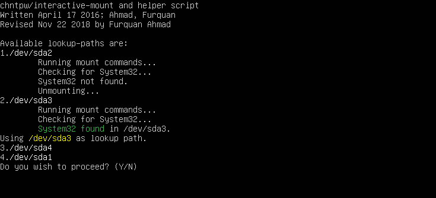

# win7-nopass
This is an interactive script to help guide the user in Windows password-recovery using `chntpw`.



Originally created in 2016 for my school project, this script (then named `cmd-explot`) used a loophole in Windows password prompts that allowed `cmd.exe` to run on the password screen and thus making the password easily recoverable with a few commands. A few years later I modified the script to use chntpw instead and used the interactive features to make the script easier to use for a relatively uninformed user than just using `chntpw`. A notable result of this script being interactive is that the user gets to choose the exact target device and it works on _dual-boot_ systems too.

Since this script is very old, the code quality isn't exactly stellar but it should be readable enough. Unlike its previous incarnations, this script shouldn't be able to cause _any_ damage to the target system unless it's a bug in `chntpw` itself.

## Requirements
* Windows-7 32/64-bit and below (**Warning**: x64 systems haven't been tested in the revised version)
* GNU Bash or bash-compatible shell
* A way to boot a Linux (or any other Unix-like) system on the target system (see: [Live-USB](https://www.pendrivelinux.com/))
* Physical access to the target system (in most cases)

## Installation and Usage

* Boot a Linux distribution on the target system (using a live-USB for example)
* Install [chntpw](http://www.chntpw.com/):
```
sudo apt-get install chntpw
```
* Clone this repository in a suitable location using:
```
git clone https://github.com/furquan-lp/sam-helper.git
```
* Edit the script constants (`LOOKUP_PATH`) if needed
* Run the script from bash (tested on `GNU bash 5.0.3`) or a bash-compatible shell as root:
```
cd sam-helper
sudo bash helper.sh
```
* Follow the instructions of the interactive script

## Issues
This script is old and hasn't been tested as much after it was modified to use `chntpw`. Prior testing is important to ensure it works properly.

* Sometimes the LOOKUP_PATHs might not cover all possible devices where Windows is installed. You may need to edit the script in such cases.
* Sometimes the script can get confused if it can't find the SAM file. Unfortunately not enough testing has been done with the revised version of the script on diverse systems so it isn't possible to fix the problem unless the issue is further investigated.
